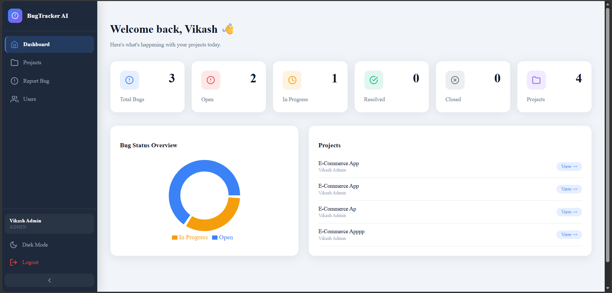
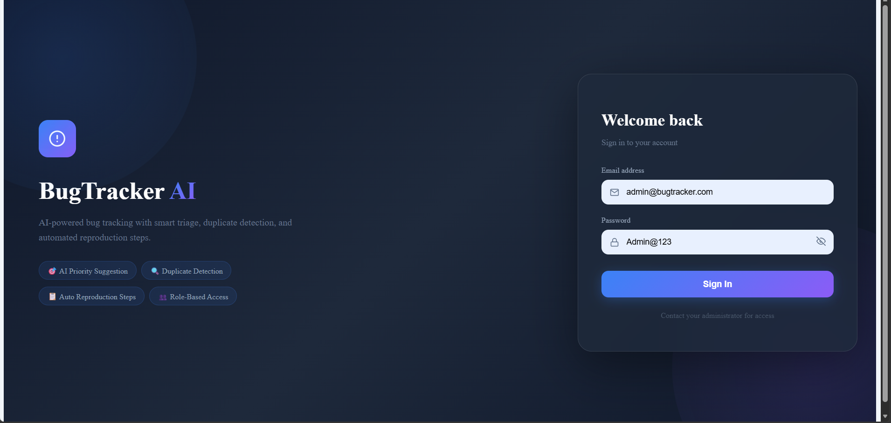
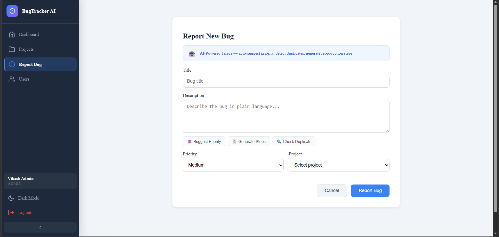
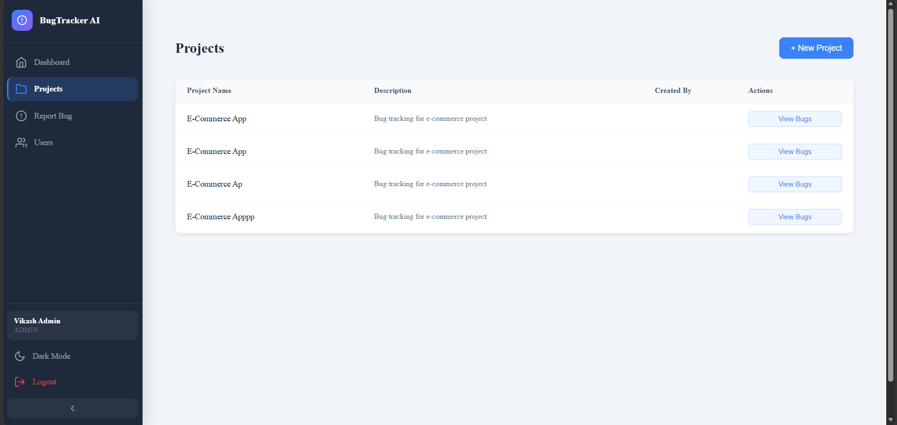
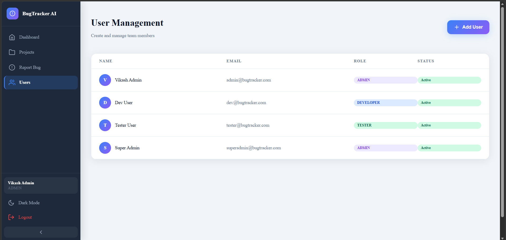

# 🐛 BugTracker AI — Frontend

> **AI-powered bug tracking with smart triage, duplicate detection, and automated reproduction steps.**  
> Built with React.js · Redux · Tailwind CSS · OpenAI API


🔗 **Backend Repo:** [bugtracker-ai-backend](https://github.com/vikash1311/bugtracker-ai)

---

## 🚀 Live Demo

🔗 **[View Live App](https://bugtrackerai.netlify.app)**

👤 **Demo Credentials:**
| Role | Email | Password |
|------|-------|----------|
| Admin | admin@bugtracker.com | Admin@123 |
| Developer | dev@bugtracker.com | Dev@123 |
| Tester | tester@bugtracker.com | Tester@123 |

---

## 📸 Screenshots

| Login | Dashboard |
|-------|-----------|
|  |  |

| Report Bug (AI Triage) | Projects |
|------------------------|----------|
|  |  |

| User Management |
|----------------|
|  |

---

## ✨ Features

### 🤖 AI-Powered Triage
- **Suggest Priority** — AI auto-suggests bug severity from plain language description
- **Check Duplicate** — detects similar existing bugs before submission
- **Generate Steps** — auto-generates developer-ready reproduction steps

### 🔐 Role-Based Views
| Role | What They See |
|------|--------------|
| **Admin** | Dashboard, Projects, Report Bug, User Management |
| **Developer** | Dashboard, Projects, Report Bug |
| **Tester** | Dashboard, Projects, Report Bug |

### 📊 Dashboard
- Real-time bug stats — Total, Open, In Progress, Resolved, Closed
- Bug Status donut chart
- Project quick-access list

### 🌙 Dark Mode
- Full dark/light mode toggle — persists across sessions

---

## 🛠️ Tech Stack

| Technology | Purpose |
|-----------|---------|
| React.js | UI framework |
| Redux | Global state management |
| Tailwind CSS | Styling |
| React Router | Client-side routing |
| Axios | API calls to backend |
| Recharts | Dashboard charts |
| OpenAI API | AI triage features |
| Netlify | Deployment |

---

## 📁 Project Structure

```
frontend/
├── public/
└── src/
    ├── components/
    │   ├── Navbar.jsx
    │   ├── Sidebar.jsx
    │   ├── BugCard.jsx
    │   └── AITriagePanel.jsx
    ├── pages/
    │   ├── Login.jsx
    │   ├── Dashboard.jsx
    │   ├── Projects.jsx
    │   ├── ReportBug.jsx
    │   └── Users.jsx
    ├── store/
    │   ├── store.js
    │   ├── authSlice.js
    │   └── bugSlice.js
    ├── api/
    │   └── axiosConfig.js
    └── App.jsx
```

---

## ⚡ Getting Started

### Prerequisites
- Node.js 18+
- Backend running locally or deployed

### Installation

```bash
git clone https://github.com/vikash1311/bugtracker-ai-frontend
cd bugtracker-ai-frontend
npm install
```

### Environment Variables

```bash
cp .env.example .env
```

```env
VITE_API_BASE_URL=http://localhost:8080
VITE_OPENAI_API_KEY=your_openai_key
```

### Run

```bash
npm run dev
```

App runs at `http://localhost:5173`

---

## 🔗 Related

- 🔧 **Backend Repo:** [bugtracker-ai-backend](https://github.com/vikash1311/bugtracker-ai)
- 🌐 **Live App:** [your-live-url.com](https://bugtrackerai.netlify.app/)
- 👤 **Portfolio:** [yourportfolio.com](https://vikash-gautam.netlify.app)

---

## 👨‍💻 Author

**Vikash Gautam** — Full Stack Developer  
📧 gautam7.ven@gmail.com  
🔗 [LinkedIn](https://linkedin.com/in/vikash2808) · [Portfolio](https://vikash-gautam.netlify.app) · [GitHub](https://github.com/vikash1311)

---

## 📄 License

MIT License
